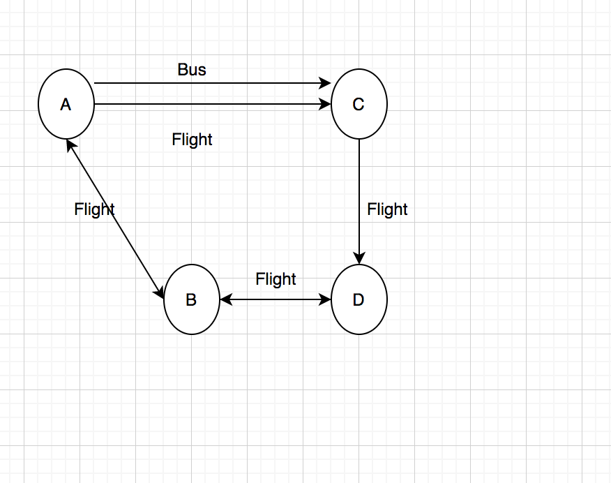
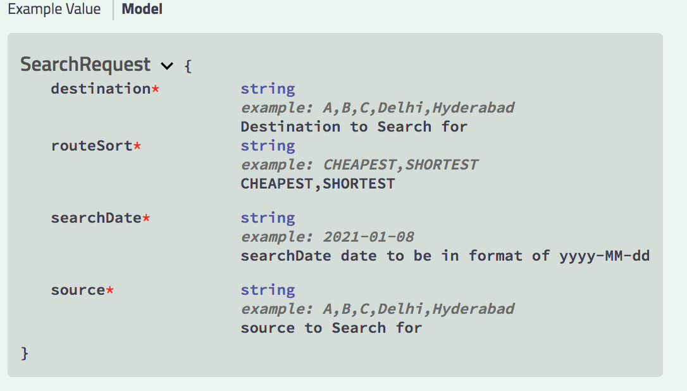

# MMT Route Planner

## Pointers
- Layover should not be more than 1 days for a customer.
- Program is searching top 50 routes over maximum of 10 hopes in the route.
- It uses **JGRAPHT** for storing routes of flight and buses. Medium of travel like Bus and Flight is used as releationship property.Database like Neo4J graph based is better candidate for this use case. 
  Data modelling of Neo4j which have more 360 view of relationships between from and to ,flexibility and better performance. Due to time constraint using in-memory graph based library.
- Program is using ConcurrentHashMap to keep track of added route in routeGraph. 
  If already added with same type like Flight no need to add again.We can use distributed Cache like Redis or Aerospike for better performance and features.
- Two kafka topic is being polled for the consumption of events mentioned in the file. These events will be sink into store and in parallel it will also create route graph.
 We can create separate pipeline for the operations
- Program is using in-memory H2 DB for Development. We should use Document based Db like Elastic or MongoDb for scalability and performance or even Oracle could also do the trick.
- It returns the List in ascending order of cheapest and shortest route.
- Send Kafka Payload in same format only as validations are not in place in **MVP**.
- Test cases to be covered in the later stage.
### Graph Diagram



#### Model 


- Swagger API Link : http://127.0.0.1:5052/swagger-ui.html#

#### Kafka Pipeline
- If Environment is not available we can disable in config/application.properties
  >kafka.enable = false 
- Topics:
  - Bus: **route-planner-bus-events**
    >{"from":"B","to":"D","date":"2021-01-08","duration":120,"fare":25,"startTime":"18:00","bus_Id":"2d3bed04-21e7-42ce-99b8-b1038ed02bca"}
  - Flight: **route-planner-flight-events**
    > {"from":"B","to":"D","date":"2021-01-08","duration":120,"fare":25,"startTime":"18:00","flight_Id":"2d3bed04-21e7-42ce-99b8-b1038ed02bca"}
    
    
##### Test Data
- flight: From [A] -> [B]----dateTime: [Jan 08 12:00:00] --endTime: [Jan 08 14:00:00]----Fare:[10]---Duration:[120]
- flight: From [B] -> [C]----dateTime: [Jan 08 15:00:00] --endTime: [Jan 08 17:00:00]----Fare:[20]---Duration:[120]
- flight: From [C] -> [D]----dateTime: [Jan 08 18:00:00] --endTime: [Jan 08 20:00:00]----Fare:[120]---Duration:[120]
- flight: From [A] -> [D]----dateTime: [Jan 08 18:00:00] --endTime: [Jan 08 21:00:00]----Fare:[30]---Duration:[180]
- flight: From [B] -> [D]----dateTime: [Jan 08 18:00:00] --endTime: [Jan 08 20:00:00]----Fare:[25]---Duration:[120]
- bus:    From [A] -> [B]----dateTime: [Jan 08 12:00:00] --endTime: [Jan 08 16:00:00]----Fare:[5]---Duration:[240]
- bus:    From [B] -> [D]----dateTime: [Jan 08 13:00:00] --endTime: [Jan 09 01:00:00]----Fare:[1]---Duration:[720]

- Cheapest Route from A --> D 
  ```json
  {
    "destination": "D",
    "source": "A",
    "routeSort": "CHEAPEST",
    "searchDate": "2021-01-08T00:00:00.000+0000",
    "routes": [
      {
        "totalFare": 30,
        "totalDuration": 180,
        "transfers": [
          {
            "source": "A",
            "destination": "D",
            "code": "4361a2d3-786a-4839-938f-7bc5c588a822",
            "startDate": "2021-01-08T12:30:00.000+0000",
            "startDateTime": null,
            "duration": 180,
            "fare": 30,
            "startTime": "18:00",
            "endDate": "2021-01-08T15:30:00.000+0000",
            "type": "FLIGHT",
            "mediumId": null
          }
        ]
      },
      {
        "totalFare": 30,
        "totalDuration": 360,
        "transfers": [
          {
            "source": "A",
            "destination": "B",
            "code": "a86e30b2-afe8-4a66-902c-87e1a95f11d9",
            "startDate": "2021-01-08T06:30:00.000+0000",
            "startDateTime": null,
            "duration": 240,
            "fare": 5,
            "startTime": "12:00",
            "endDate": "2021-01-08T10:30:00.000+0000",
            "type": "BUS",
            "mediumId": null
          },
          {
            "source": "B",
            "destination": "D",
            "code": "73633865-cdcd-4e7f-be03-55d48df14e63",
            "startDate": "2021-01-08T12:30:00.000+0000",
            "startDateTime": null,
            "duration": 120,
            "fare": 25,
            "startTime": "18:00",
            "endDate": "2021-01-08T14:30:00.000+0000",
            "type": "FLIGHT",
            "mediumId": null
          }
        ]
      },
      {
        "totalFare": 35,
        "totalDuration": 240,
        "transfers": [
          {
            "source": "A",
            "destination": "B",
            "code": "4c65f863-f58a-45e8-a4c4-ec087b9a243a",
            "startDate": "2021-01-08T06:30:00.000+0000",
            "startDateTime": null,
            "duration": 120,
            "fare": 10,
            "startTime": "12:00",
            "endDate": "2021-01-08T08:30:00.000+0000",
            "type": "FLIGHT",
            "mediumId": null
          },
          {
            "source": "B",
            "destination": "D",
            "code": "73633865-cdcd-4e7f-be03-55d48df14e63",
            "startDate": "2021-01-08T12:30:00.000+0000",
            "startDateTime": null,
            "duration": 120,
            "fare": 25,
            "startTime": "18:00",
            "endDate": "2021-01-08T14:30:00.000+0000",
            "type": "FLIGHT",
            "mediumId": null
          }
        ]
      },
      {
        "totalFare": 150,
        "totalDuration": 360,
        "transfers": [
          {
            "source": "A",
            "destination": "B",
            "code": "4c65f863-f58a-45e8-a4c4-ec087b9a243a",
            "startDate": "2021-01-08T06:30:00.000+0000",
            "startDateTime": null,
            "duration": 120,
            "fare": 10,
            "startTime": "12:00",
            "endDate": "2021-01-08T08:30:00.000+0000",
            "type": "FLIGHT",
            "mediumId": null
          },
          {
            "source": "B",
            "destination": "C",
            "code": "3e651e0d-0e03-4c8f-85c6-2e2a6a25e260",
            "startDate": "2021-01-08T09:30:00.000+0000",
            "startDateTime": null,
            "duration": 120,
            "fare": 20,
            "startTime": "15:00",
            "endDate": "2021-01-08T11:30:00.000+0000",
            "type": "FLIGHT",
            "mediumId": null
          },
          {
            "source": "C",
            "destination": "D",
            "code": "b1adfc92-46bd-490f-9d6a-de6ecb4c97b4",
            "startDate": "2021-01-08T12:30:00.000+0000",
            "startDateTime": null,
            "duration": 120,
            "fare": 120,
            "startTime": "18:00",
            "endDate": "2021-01-08T14:30:00.000+0000",
            "type": "FLIGHT",
            "mediumId": null
          }
        ]
      }
    ]
  }
  
  ```
- Shortest Duration Route from A --> D 
```json
{
  "destination": "D",
  "source": "A",
  "routeSort": "SHORTEST",
  "searchDate": "2021-01-08T00:00:00.000+0000",
  "routes": [
    {
      "totalFare": 30,
      "totalDuration": 180,
      "transfers": [
        {
          "source": "A",
          "destination": "D",
          "code": "4361a2d3-786a-4839-938f-7bc5c588a822",
          "startDate": "2021-01-08T12:30:00.000+0000",
          "startDateTime": null,
          "duration": 180,
          "fare": 30,
          "startTime": "18:00",
          "endDate": "2021-01-08T15:30:00.000+0000",
          "type": "FLIGHT",
          "mediumId": null
        }
      ]
    },
    {
      "totalFare": 35,
      "totalDuration": 240,
      "transfers": [
        {
          "source": "A",
          "destination": "B",
          "code": "4c65f863-f58a-45e8-a4c4-ec087b9a243a",
          "startDate": "2021-01-08T06:30:00.000+0000",
          "startDateTime": null,
          "duration": 120,
          "fare": 10,
          "startTime": "12:00",
          "endDate": "2021-01-08T08:30:00.000+0000",
          "type": "FLIGHT",
          "mediumId": null
        },
        {
          "source": "B",
          "destination": "D",
          "code": "73633865-cdcd-4e7f-be03-55d48df14e63",
          "startDate": "2021-01-08T12:30:00.000+0000",
          "startDateTime": null,
          "duration": 120,
          "fare": 25,
          "startTime": "18:00",
          "endDate": "2021-01-08T14:30:00.000+0000",
          "type": "FLIGHT",
          "mediumId": null
        }
      ]
    },
    {
      "totalFare": 30,
      "totalDuration": 360,
      "transfers": [
        {
          "source": "A",
          "destination": "B",
          "code": "a86e30b2-afe8-4a66-902c-87e1a95f11d9",
          "startDate": "2021-01-08T06:30:00.000+0000",
          "startDateTime": null,
          "duration": 240,
          "fare": 5,
          "startTime": "12:00",
          "endDate": "2021-01-08T10:30:00.000+0000",
          "type": "BUS",
          "mediumId": null
        },
        {
          "source": "B",
          "destination": "D",
          "code": "73633865-cdcd-4e7f-be03-55d48df14e63",
          "startDate": "2021-01-08T12:30:00.000+0000",
          "startDateTime": null,
          "duration": 120,
          "fare": 25,
          "startTime": "18:00",
          "endDate": "2021-01-08T14:30:00.000+0000",
          "type": "FLIGHT",
          "mediumId": null
        }
      ]
    },
    {
      "totalFare": 150,
      "totalDuration": 360,
      "transfers": [
        {
          "source": "A",
          "destination": "B",
          "code": "4c65f863-f58a-45e8-a4c4-ec087b9a243a",
          "startDate": "2021-01-08T06:30:00.000+0000",
          "startDateTime": null,
          "duration": 120,
          "fare": 10,
          "startTime": "12:00",
          "endDate": "2021-01-08T08:30:00.000+0000",
          "type": "FLIGHT",
          "mediumId": null
        },
        {
          "source": "B",
          "destination": "C",
          "code": "3e651e0d-0e03-4c8f-85c6-2e2a6a25e260",
          "startDate": "2021-01-08T09:30:00.000+0000",
          "startDateTime": null,
          "duration": 120,
          "fare": 20,
          "startTime": "15:00",
          "endDate": "2021-01-08T11:30:00.000+0000",
          "type": "FLIGHT",
          "mediumId": null
        },
        {
          "source": "C",
          "destination": "D",
          "code": "b1adfc92-46bd-490f-9d6a-de6ecb4c97b4",
          "startDate": "2021-01-08T12:30:00.000+0000",
          "startDateTime": null,
          "duration": 120,
          "fare": 120,
          "startTime": "18:00",
          "endDate": "2021-01-08T14:30:00.000+0000",
          "type": "FLIGHT",
          "mediumId": null
        }
      ]
    }
  ]
}

```
